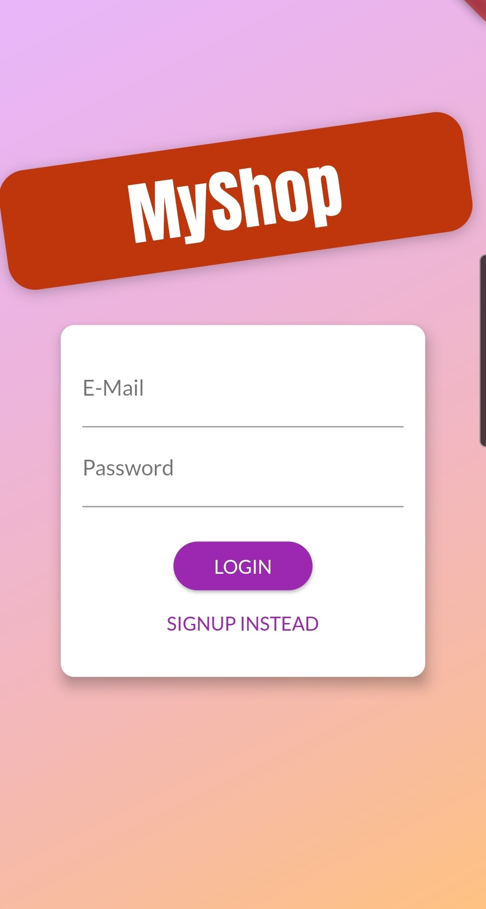
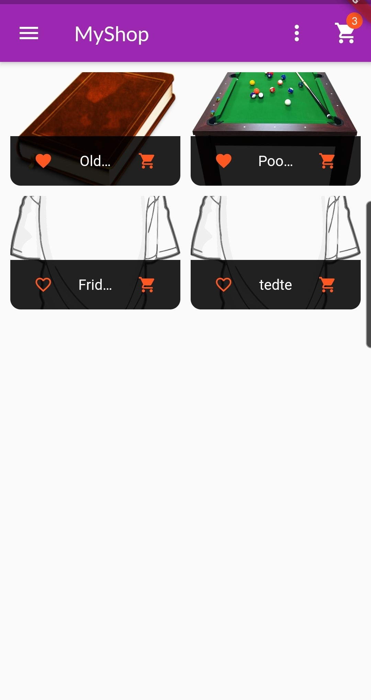
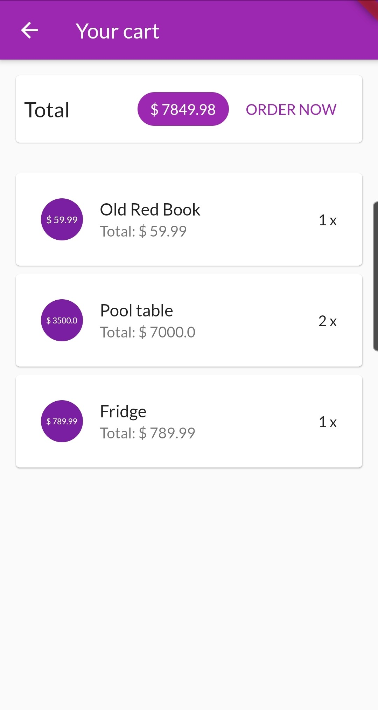

# shop_app

A custom shop app made with Flutter where the clients list and sell their own products.

<table>
    <tr>
        <td>Login page</td>
        <td>Products page</td>
    </tr>
    <tr>
        <td>Product details page</td>
        <td>Cart page</td>
    </tr>
    </tr>
    <tr>
        <td></td>
        <td></td>
    </tr>
    <tr>
        <td></td>
        <td></td>
    </tr>
 </table>